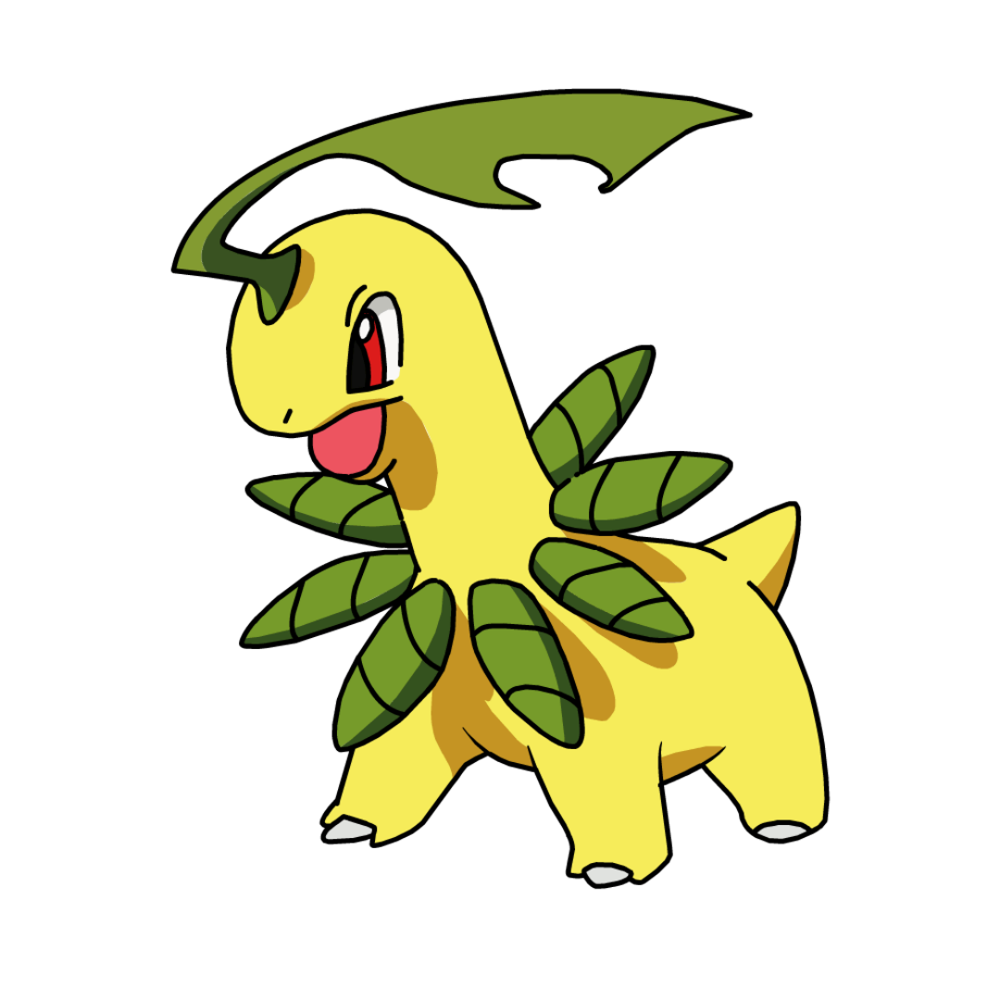
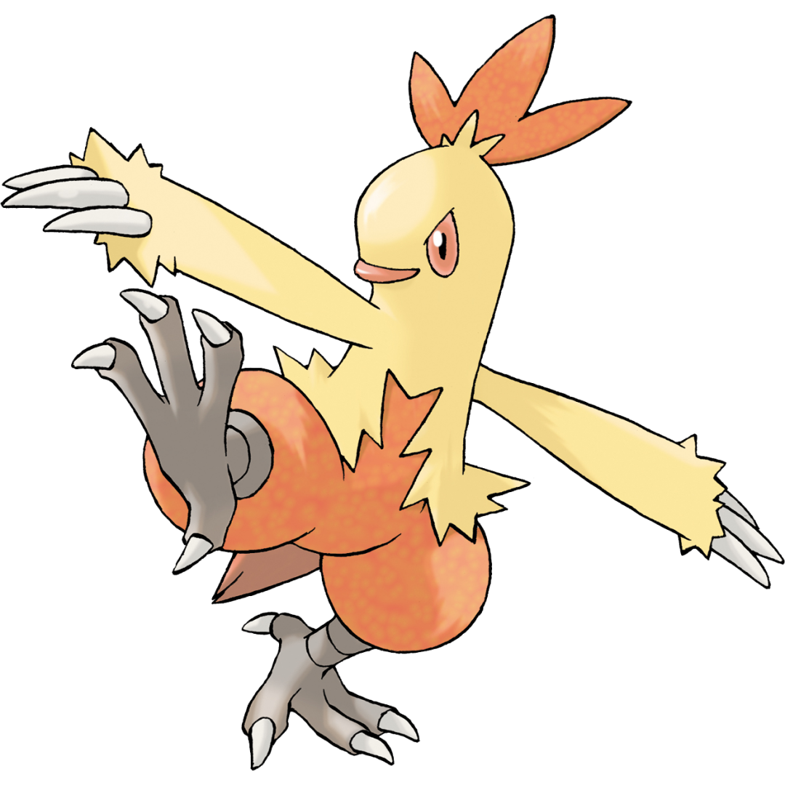
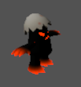

# SUSTecher GO!

## 1 简介

### 1.1 游戏简介

SUSTecher GO！是一个集成**校园探索** , **宠物收集培养**，**增强现实技术**，**商店抽卡**，**任务对话**和**战旗对战**的游戏。

### 1.2 受众群体

南方科技大学未入校的大一新生，所有南科大在校生，参观南方科技大学的游客，前往南方科技大学游学的小学、初高中生

## 2 安装指南

### 2.1 系统需求

目前只支持安卓8以上，以及arm64架构的手机（满足AR需求）

### 2.2 游玩

游戏通过Unity打包的apk安装包进行安装，apk目前有以下获取方式

1. 云盘：https://pan.baidu.com/s/1nY-sy7UuIpc34OeuL8J7Vw?pwd=0721 
2. 若失效，请联系Nian：12110416@mail.sustech.edu.cn

## 3 游戏玩法

### 3.1 基本规则

SUSTecher GO！是一个集成**校园探索** , **宠物收集培养**，**增强现实技术（AR）**，**商店抽卡**，**任务对话**和**战旗对战**的游戏。

#### 3.1.1 校园探索

​	在校园探索部分，游戏鼓励玩家通过实景探索南科大，并通过GPS移动的方式来进行主要的地图移动，为了保证用户在关键建筑周围能够触发Boos战，捡拾物品，而不出现偏差，地图中搭载了人物操控杆，可以同时用于控制人物。同时，在场地允许的情况下，玩家能够在Map中显示的宠物位置的实景场景中找到相应的宠物帖纸，打开AR进行宠物捕捉。

#### 3.1.2 宠物收集培养

   游戏一共设计了22种宠物（后续物品介绍将会详细介绍），每个宠物设计了四个技能。精灵等级一共分30级，等级越高，血条越厚，技能越强。宠物的获取有三种方式，一是初始的向导NPC领取（皮卡丘、水箭龟、喷火龙）根据书院三选一；二是通过精灵球，进行AR捕捉（游戏内一共有四种精灵球，后面会介绍到）；三是商店抽卡

   游戏内有背包，在背包内可以查看宠物的等级，技能，数值；也可以使用食物培育宠物

#### 3.1.3 增强现实技术（AR）

​	当玩家打开AR进行捕捉时，玩家可以选择要使用的物品。一共分为两类：精灵球和食物。

​	食物可以提高宠物对玩家的好感度，提高捕捉概率，同时玩家可以实时看到当前宠物的好感度以及使用当前种类精灵球的捕捉概率；精灵球有四种，普通，高级，史诗，神话，不同的精灵球对应不同的捕捉概率，按照稀有度捕捉概率从低到高，神话精灵球的捕捉概率为100%。

​	玩家可以在相机范围内通过滑动屏幕扔出精灵球，通过控制角度使精灵球和宠物碰撞，以完成宠物收集。收集成功将会有成功面板。

#### 3.1.4 商店抽卡

   游戏地图搭载了商店、和抽卡模块。玩家的金钱主要来自于和向导对话领取，任务的完成，以及击败boss获得。商店里可以购买药水、食物、精灵球等物品。在抽卡模块，玩家使用金币选择单抽或者六连抽，抽卡不仅可以获得之前提及的物品，还有可能获得稀有宠物。

#### 3.1.5 任务对话

   在游戏过程中玩家可以通过完成任务，与NPC对话，来获取必要的指导。任务界面会防止一些预先定义好的任务，玩家可以根据自己的想法去完成任务。同时，游戏的map种一共设置了13个boss，这13个不同的boss分布在南科大的13个关键建筑，当玩家控制人物走到boss旁边并点击时，将会触发NPC对于关键建筑的介绍（NPC的所有对话都接入了AI训练的语音，语音资源来自于原神角色可莉，AI模型为线上预训练好的模型），之后将会触发是否对战的面板，弱选择对战将会跳转到对战场景。

#### 3.1.6 战旗对战

   玩家在地图中触发Boss战时，首先在对战场景种选取最少一个，最多三个宠物进行对战，对战系统为3D类战旗RPG。我方先手，boss后手，按轮次依次进行操作。每个己方宠物在每个轮次都有20点选择点，每个技能或者每个移动损耗5点行动点（移动的格子不能超过4）。Boss行动策略亦然，会根据当前敌方最近宠物进行策略选择。战斗结束条件为己方宠物全部血量为0或者地方boss血量为0。最后会根据己方宠物剩余血量和操作步数结算战斗得分。

## 3 游戏界面

### 3.1 主菜单（LBS系统）

    

### 3.2 游戏界面

#### 3.2.1 宠物&精灵背包

    

    

#### 3.2.2 增强现实技术（AR）

    

#### 3.2.3 商店&抽卡面板

    

    

#### 3.2.4 任务面板

    

#### 3.2.5 对战界面

    

    

## 4 控制与操作

### 4.1 人物控制

在Map场景中，人物的控制可以有两种手段：

1. Map场景左下角的操纵杆（通过滑动操纵杆控制人物）
2. Map场景右上角的定位按钮（根据GPS精准定位）

## 5 游戏任务

目前游戏任务主要分为以下几类：

1. 探索任务：例如找到向导之后完成任务

2. 收集任务：收集某些物品/精灵之后完成任务

3. 挑战任务：击败某个或者某些boss之后触发

4. 培养任务：培养某个宠物到达特定等级触发

5. 成就任务：击败所有boss/收集所有宠物/使用神话精灵球等

## 6 物品介绍

### 6.1 宠物介绍

| 序号 |   英文名   | 中文名     | 描述                                                         |                             图片                             |
| :--: | :--------: | ---------- | ------------------------------------------------------------ | :----------------------------------------------------------: |
|  1   |  pikachu   | 皮卡丘     | 一只黄色小精灵，外形像可爱的小老鼠，它友好又勇敢，肌肤为黄色，背部有褐色条纹，耳朵尖端为黑色。 |  |
|  2   | blastoise  | 水箭龟     | 一只蓝色的精灵，外形是只乌龟，它坚韧又强大，在龟壳的前端伸出了两门水炮，这两门水炮可以缩进龟壳里。 |  |
|  3   | charizard  | 喷火龙     | 一只橙色的精灵，外形是只恐龙，它有强大的战斗力和威严的气势，。它长着短而粗壮的下肢和相对细小的上肢，上肢有着三根锐利的爪子，同时脚上也长着三颗尖爪。 |  |
|  4   |  Blaziken  | 火焰鸡     | 拥有一头白色的羽毛和V字形的鸡冠。它的眼睛是蓝色的。它还有着缠着绷带的爪和强健有力的双腿。 |  |
|  5   |  Bayleef   | 月桂叶     | 身体是黄色的，在脖子周围那些圆圆卷起的叶子中都长有1个小树芽。一片镰刀形状的大叶子从月桂叶头上突出来，叶片上有一个椭圆形的缺口。 |  |
|  6   |  Breloom   | 斗笠菇     | 体型如同袋鼠，身体以绿色和米黄色为主，四肢上有两个红色的爪指。它头上的蘑菇形成了斗笠状，上方有两个红色的球形物体对称地长在两边。 |  |
|  7   |   Celebi   | 时拉比     | 上半身为浅绿色，下半身为草绿色。头部为圆形，并呈弧线状汇聚在脑后且末端为草绿色。它的后背上有一对翅膀，前额上长有带蓝色尖端的绿色触角。 |   |
|  8   |  Camerupt  | 喷火驼     | 喷火驼的外表以橘红色为主，嘴巴附近为淡肤色，身体两侧各有三个亮蓝色的圆圈。背上的驼峰有类似岩石的结构，头上有三撮上翘的毛发，脚部有蹄。 |  |
|  9   |  Chimchar  | 小火焰猴   | 皮毛以橙色为主，面部、外耳、腹部、手掌及脚掌则为浅黄色。小火焰猴有一双大耳朵，内耳呈红色。它的眼睛上方有半圈红色的花纹，胸口上有一个旋涡状的标记。 |  |
|  10  | Charmeleon | 火恐龙     | 头顶长出了一个角状凸起，嘴巴变尖，有点类似鸟喙。它的四肢和尾巴较长，尾巴末端依然燃烧着火焰。 |  |
|  11  | Decidueye  | 狙射树枭   | 一只温和的绿色精灵，身上覆盖着绒绒的绿色毛发，长长的耳朵上戴着一对花环，活泼可爱的大眼睛里闪烁着聪明的光芒。 |  |
|  12  |  Darkrai   | 达克莱伊   | 一只神秘的黄色精灵，身形修长，覆盖着浓密的黑色斗篷，深邃的眼睛中闪烁着幽暗的光芒 |  |
|  13  |  Cobalion  | 科布       | 一只高大而威严的精灵，身躯覆盖着银色坚硬的铠甲，眼睛中闪烁着坚定的光芒。它是坚决捍卫正义的守护者，外表展现出高贵和庄严的气质。性格坚毅而勇敢，具有无比的正义感和责任感，时刻准备着保护弱者和维护和平。 |  |
|  14  |  Corsola   | 珊瑚水母   | 一只可爱的粉色精灵，身体呈珊瑚形状，覆盖着粉色的珊瑚块和淡蓝色的斑点，它拥有慵懒而温和的性格。 |  |
|  15  | Combusken  | 猛火鸡     | 一只精力充沛的精灵，身形纤瘦但肌肉结实，覆盖着橙色的鸡冠和黄色的鸡脚，眼神中透露着坚定和热情。 |  |
|  16  |  Cradily   | 摇篮百合   | 一种与植物相似的绿色精灵，它的头部、脖子和躯干上有着不同式样的黄色标记。它的头上有着新月形的开口，开口上还有一对圆形的黄色眼点，有八条粉色的触须环绕在它的头部根处。 |  |
|  17  |  Croconaw  | 蓝鳄       | 身体是蓝色的，肚子上有着米色的花纹。它的嘴里总是长满着48颗牙齿。它的头部、背部、尾部均分布着红色的骨板。 |  |
|  18  |  Dartrix   | 投羽枭     | 外形就像是一只猫头鹰，它的身体整体颜色以白色和绿色为主，大部分时候它都是眯着眼睛的。投羽枭非常自恋，又爱美，是注重外表，很在意自己的外观的精灵 |  |
|  19  | Chikorita  | 菊草叶     | 身体是淡绿色的，头上有一片深绿色的叶子，脖子长著一圈芽。它的头跟身体上的其他部位相比相当的大，有着红色的大眼睛。它的四只短脚分别有一根带指甲的脚趾，它还有一条小小的尾巴。 |  |
|  20  | Cyndaquil  | 火球鼠     | 头部除长吻外呈球形。火球鼠的颜色可以分成两部分：背部及头部上方为墨蓝色；头部下方、胸部、腹部及四肢则为奶黄色。它背部上的四个红色的小孔会喷出火柱。 |  |
|  21  |   Cubone   | 卡拉卡拉   | 它拿着一根骨头，并作为武器，身体是褐色的，腹部为亚麻色，手指、脚尖有着白色的指甲，还有着短短的尾巴。 |  |
|  22  | Cresselia  | 克雷色利亚 | 有浅蓝色的身体，腹部是黄色的，头两侧的有着月牙状的黄色装饰。粉色的环形翅膀在侧面和后背，有爪子状的前端放在胸前 |  |

### 6.2 Boss介绍

| 序号 |   英文名    |                          图片                           |  出没地点  |
| :--: | :---------: | :-----------------------------------------------------: | :--------: |
|  0   |     Bat     |  | 第一教学楼 |
|  1   |  Bat Lord   |  | 第一科研楼 |
|  2   |     Bee     |  | 一丹图书馆 |
|  3   |    Bird     |  |  湖畔食堂  |
|  4   |  Fledgling  |  |  中心食堂  |
|  5   |    Ghost    |  | 琳恩图书馆 |
|  6   |   Phantom   |  |   理学院   |
|  7   |    Shade    |  |   商学院   |
|  8   |   Shadow    |  | 第三教学楼 |
|  9   |   Spider    |  | 涵泳图书馆 |
|  10  | Spider King |  |  风雨操场  |
|  11  |    Sting    |  |  社康中心  |
|  12  | Vampire Bat |  | 润扬体育馆 |

### 6.3 NPC介绍	

| 属性 | 内容                                                         |
| ---- | ------------------------------------------------------------ |
| 姓名 | 妮可（取自南科大昵称）                                       |
| 外貌 | 《天使之翼》女主角半身立绘头像素材                           |
| 声线 | 原神GPT-sovits模型https://pan.baidu.com/s/1mNs9uLjHSfK7zmpIgLVe6Q?pwd=jye3，使用可莉语音 |
| 表情 | 图来源于网站https://www.aigei.com/view/73331.html#items，《天使之翼》女主角半身立绘头像素材一套12张 |

### 6.4 道具介绍

#### 精灵球

| 名称       |
| ---------- |
| 初级精灵球 |
| 高级精灵球 |
| 史诗精灵球 |
| 神话精灵球 |

#### 食物

| 名称     | 效果           |
| -------- | -------------- |
| 饼干     | 获得50经验     |
| 烤肠     | 获得100经验    |
| 蛋糕     | 获得20经验     |
| 敏捷药水 | 回合耐力增加20 |

## 7 游戏进度与保存

目前游戏为单机储存模式，支持重新刷新存档和继续游戏。

## 8 游戏规模

- Lines of Code、Number of source files
  - 
- Number of packages/modules
  - 
- Number of dependencies
  - 
  - 

## 8 故障与排除

目前为demo0.97版本，游玩过程中发现bug可以联系：

Nian：12110416@mail.sustech.edu.cn
